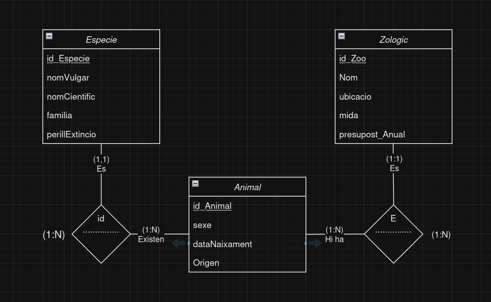

# 1. Zoos

Es vol dissenyar una base de dades relacional per emmagatzemar informació relativa als zoos existents en el món, així com les espècies i animals que aquests alberguen.

- De cada zoo es vol emmagatzemar el seu codi, nom, la ciutat i país on es troba, mida (m2) i pressupost anual.

- Cada zoo codifica els seus animals amb un codi propi, de manera que entre zoos es pot donar el cas que es repeteixi.

- De cada espècie animal s'emmagatzema un codi d'espècie, el nom vulgar, el nom científic, família a la qual pertany i si es troba en perill d'extinció.

- A més, s'ha de guardar informació sobre cada animal que els zoos tenen, com el seu número d'identificació, espècie, sexe, any de naixement, país d'origen i continent.

# 2. Model conceptual
## 2.1. Enllaç públic a l'esquema
[2.Zoos] https://drive.google.com/file/d/1bwYA0BM5QQ7ZGpE2-4_yqzShyODmaIh0/view?usp=drive_link

## 2.2. Esquema conceptual (EC ó ER)
  

# 3. Model lògic relacional
## 3.1. Esquema lògic
Zoo(<ins>Codi_zoo</ins>,Nom, Ciutat, País, Pressupost,)\
Animal_Especie(<ins>Codi_Especie/Codi_zoo</ins>, Nom_Vulgar, Nom_Cientific, Familia, Perill_existencia)\
Animal(<ins>Codi_Animal</ins>, Sexe, Data_Naixement, Pais, Codi_Especie)  

## 3.2. Diagrama referencial
Relació referencial|Clau aliena|Relació referida
-|-|-
Animal_Especie|Codi_zoo|Zoo
Animal|Codi_Especie/Codi_zoo|Animal_Especie

# 4. Model físic
## 4.1 Enllaç a l'esquema físic
- Encara no hem arribat a fer SQL.